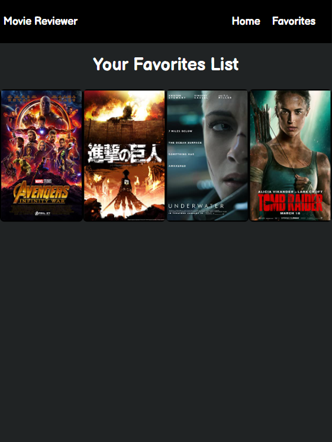

# Movie Reviewer

An application written in HTML, CSS, and JavaScript implementing AJAX functions to send and receive information from the OMDb (Open Movie Database) API to obtain a chosen movie's image, ratings, length, and plot description. The user is able to see a variety of movies in a specific genre, and append that movie to their favorites list if they choose to re-watch the movie in the future.

Check out my demonstration video [here!](https://youtu.be/Ck2nSHmCJkI)

## Current Feature List:
<ul>
  <li>User can input and see their naem on the home page's greeting section.</li>
  <li>User can navigate to the home page and favorites page in the navbar.</li>
  <li>User can browse the action genre movies.</li>
  <li>User can view the movie's image, title, ratings, length, and description.</li>
  <li>User can add a movie to their favorites list.</li>
  <li>User can remove a movie from their favorites list.</li>
</ul>

## Planned additions:
<ul>
  <li>User can browse more genres other than action. (:white_check_mark:)</li>
  <li>Implement a carousel effect so that more than 4 movies can fit within a genre.</li>
</ul>

## What I learned from working on this project:
<ul>
  <li>Building my own FIGMA wireframe.</li>
  <li>Planning the issues, and the functionality that goes into a certain implementation idea.</li>
  <li>Finding and implementing API keys from an external site.</li>
  <li>Using XHR (XMLHttpRequest) and the request in order to input data and create jQueries based on the response given.</li>
  <li>Making a "data unavailable" page whenever the user has not put any movies in the favorites section.</li>
</ul>

## Preview Images
### Login Page  
 
### Category Page 
 
### Movie Description Page 
 
### Empty Favorites Page 
 
### Filled Favorites Page 
 
