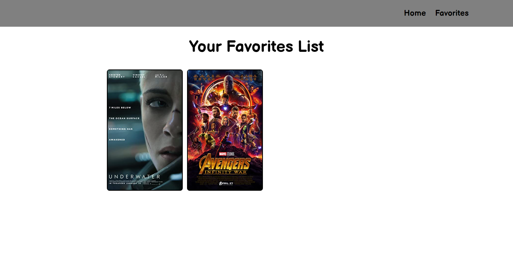

# Movie Reviewer

An application written in HTML, CSS, and JavaScript consisting of AJAX methods to showcase an array of movies and their descriptions,
featuring the implementation of an API key from a movie information database (The Open Movie Database).

* Check out my demonstration video [here!](https://drive.google.com/file/d/1uayOPgz3RvMtt8uw6Gs2WeJOnyoI5GSk/view?usp=sharing)

* Current Feature List:
  * User can input and see their naem on the home page's greeting section.
  * User can navigate to the home page and favorites page in the navbar.
  * User can browse the action genre movies.
  * User can view the movie's image, title, ratings, length, and description.
  * User can add a movie to their favorites list.
  * User can remove a movie from their favorites list.

* Planned additions:
  * User can browse more genres other than action.
  * Implement a carousel effect so that more than 4 movies can fit within a genre.

* What I learned from working on this project:
  * Building my own FIGMA wireframe.
  * Planning the issues, and the functionality that goes into a certain implementation idea.
  * Finding and implementing API keys from an external site.
  * Using XHR (XMLHttpRequest) and the request in order to input data and create jQueries based on the response given.
  * Making a "data unavailable" page whenever the user has not put any movies in the favorites section.

